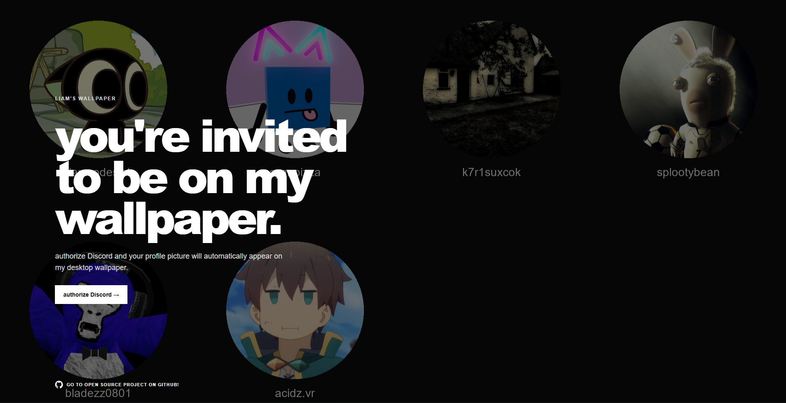
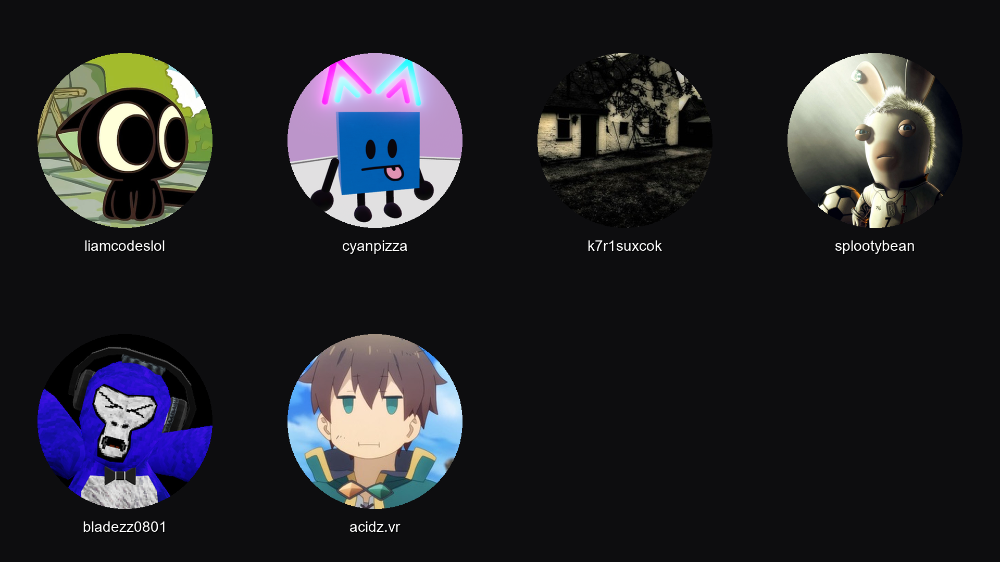

# Liam's Wallpaper

## ONLY FOR WINDOWS, if enough ppl want it i'll make a linux or mac version but lowk i dont got a mac cuz im broke as shit

Little project I've made so that my friends can put themselves on my desktop wallpaper as a fun little thing I guess.

Friends are authorized via Discord OAuth2 and their profile picture is added automatically to the wallpaper! If they change their avatar in the future, the wallpaper is updated automatically which is done by Python periodically.

  
  
  
  

  <a href="#setup">Setup</a>
  ·
  <a href="#configuration">Configuration</a>
  ·
  <a href="#how-it-works">How it works</a>
  ·
  <a href="#routes">Routes</a>

---

## Preview

> Add screenshots/GIFs of the website and wallpaper here.

  
  

---

## What it does

* Discord friends can authorize themselves with one click
* Their Discord avatar is automatically added to the wallpaper
* Usernames are shown underneath each avatar
* Wallpaper is automatically generated as a PNG file
* Windows automatically switches to the new wallpaper
* Avatars are periodically checked for any
